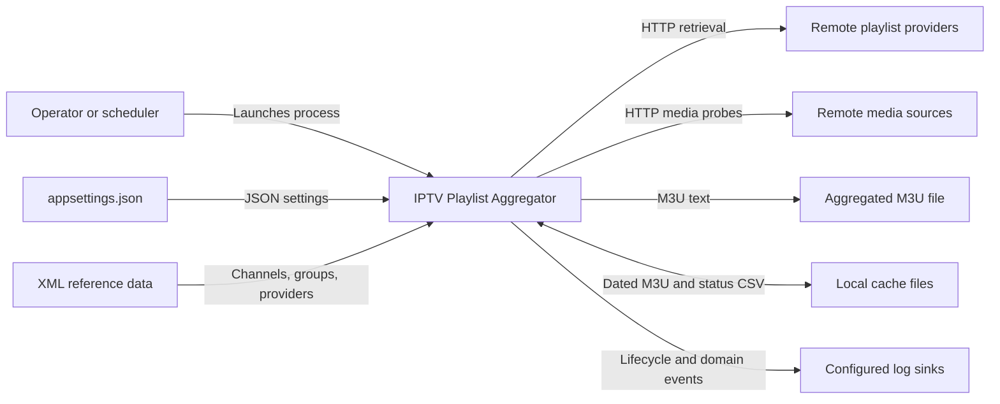
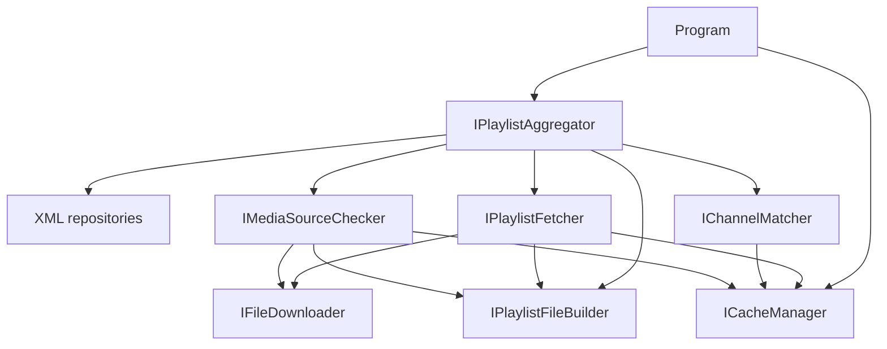
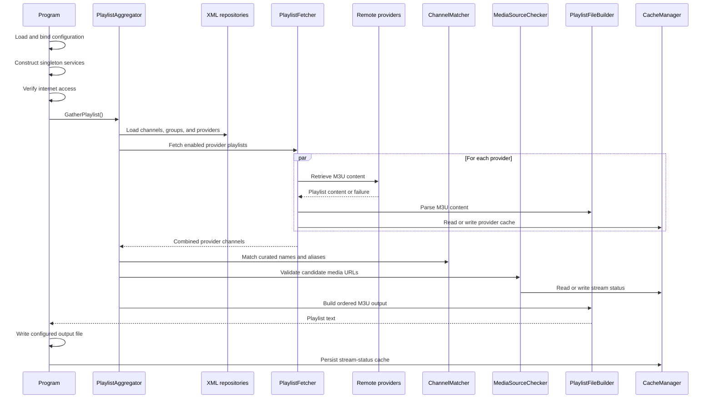
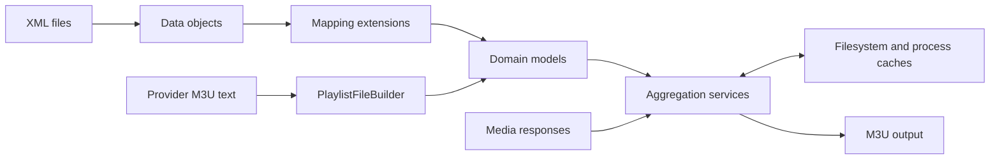
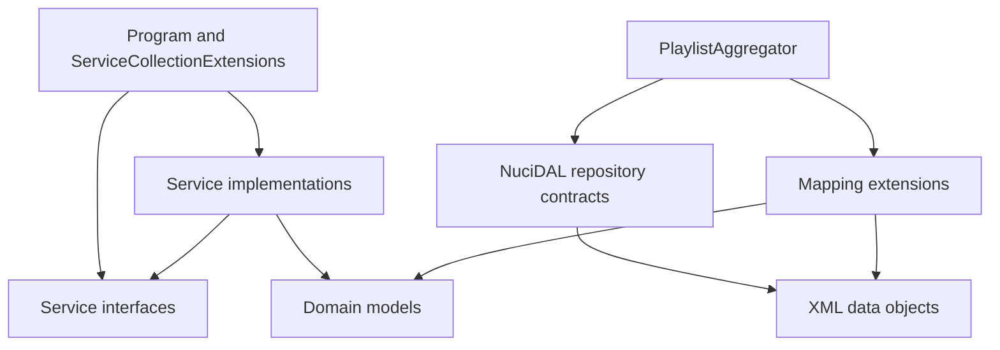

# IPTV Playlist Aggregator Architecture

This document describes the verified current architecture of the .NET console application in this repository. It covers the executable pipeline, data and integration boundaries, persistent state, operational constraints, and extension contracts; proposed architectures are outside its scope.

## 📑 Table of Contents

- [Table of Contents](#table-of-contents)
- [Purpose](#purpose)
- [System Context](#system-context)
- [Architectural Style](#architectural-style)
- [Runtime Flow](#runtime-flow)
- [Components](#components)
- [Data Architecture](#data-architecture)
- [Interfaces and Integrations](#interfaces-and-integrations)
- [Matching and Selection](#matching-and-selection)
- [Caching](#caching)
- [Cross-Cutting Concerns](#cross-cutting-concerns)
    - [Security and Privacy](#security-and-privacy)
    - [Error Handling](#error-handling)
    - [Observability](#observability)
    - [Configuration](#configuration)
    - [Concurrency and Resource Use](#concurrency-and-resource-use)
- [Dependency Direction and Rules](#dependency-direction-and-rules)
- [External Dependencies](#external-dependencies)
- [Deployment and Operations](#deployment-and-operations)
- [Compatibility Contracts](#compatibility-contracts)
- [Testing and Verification](#testing-and-verification)
- [Design Constraints](#design-constraints)
- [Extension Points](#extension-points)
    - [Data Sources](#data-sources)
    - [Transport](#transport)
    - [Matching and Validation](#matching-and-validation)
    - [Playlist Formats](#playlist-formats)
- [Source Map](#source-map)
- [Related Documentation](#related-documentation)

## 🎯 Purpose

IPTV Playlist Aggregator retrieves M3U playlists from configured providers, maps their channels to curated channel definitions, validates media sources, and emits one aggregated M3U playlist. The architectural scope includes the process lifecycle, service pipeline, XML reference data, HTTP integrations, filesystem state, and generated output.

This document is intended for maintainers and operators who modify the pipeline or diagnose its execution. Recording ownership, dependency direction, and compatibility-sensitive formats permits changes to be evaluated without obscuring the limits of the current single-process design.

## 🌐 System Context

The application boundary contains one console process and its dependency-injected services. An operator or scheduler initiates the process; local files provide configuration and curated reference data; remote systems provide playlists and media responses; and the process produces local playlist, cache, and log artefacts.



The principal external boundaries are:
- **Process invocation:** an operator or scheduler launches one finite console process; no inbound network interface or interactive command protocol exists.
- **Configuration:** [IptvPlaylistAggregator/appsettings.json](IptvPlaylistAggregator/appsettings.json) supplies application, cache, datastore, and logger settings from the local trust domain.
- **Reference data:** [IptvPlaylistAggregator/Data/channels.xml](IptvPlaylistAggregator/Data/channels.xml), [IptvPlaylistAggregator/Data/groups.xml](IptvPlaylistAggregator/Data/groups.xml), and [IptvPlaylistAggregator/Data/providers.xml](IptvPlaylistAggregator/Data/providers.xml) define the desired channels, output groups, and playlist providers.
- **Provider HTTP endpoints:** remote M3U files are retrieved from provider URL formats.
- **Media HTTP endpoints:** candidate channel URLs are probed to determine whether they are playable.
- **File output:** the aggregated playlist is written to the configured output path.
- **Cache storage:** dated provider playlists and stream-status data are persisted beneath the configured cache directory.
- **Logging:** `NuciLog` records lifecycle and domain operations using the configured sinks and minimum level.

The local configuration, reference data, output, and cache belong to the operator-controlled filesystem boundary. Provider playlists and media responses cross a remote trust boundary and are processed as external input.

## 🏗️ Architectural Style

The codebase implements a single-process, dependency-injected batch pipeline with explicit service contracts. `Program` composes singleton collaborators, while `PlaylistAggregator` owns the ordered application workflow. Interfaces isolate retrieval, parsing, matching, validation, caching, and output generation, but all stages execute within one process and share no distributed transaction or queue.



All application services and repositories use singleton lifetime. This corresponds to the batch-process model and permits the cache manager, downloader, and parser to share in-memory state throughout one execution.

The principal architecture boundaries are:
- **Composition and process lifecycle:** [IptvPlaylistAggregator/Program.cs](IptvPlaylistAggregator/Program.cs) loads configuration, constructs the dependency injection container, checks connectivity, invokes aggregation, writes the result, persists the cache, and records process-level failures.
- **Application services:** [IptvPlaylistAggregator/Service/](IptvPlaylistAggregator/Service/) contains orchestration, retrieval, parsing, matching, media validation, caching, and output generation.
- **Domain models:** [IptvPlaylistAggregator/Service/Models/](IptvPlaylistAggregator/Service/Models/) represents playlists, channels, curated definitions, groups, providers, and stream states.
- **Persistence adapters:** [IptvPlaylistAggregator/DataAccess/DataObjects/](IptvPlaylistAggregator/DataAccess/DataObjects/) models XML records; `NuciDAL` repositories read those records from configured files.
- **Mappings:** [IptvPlaylistAggregator/Service/Mapping/](IptvPlaylistAggregator/Service/Mapping/) converts XML data objects to and from domain models at the orchestration boundary.

## 🔄 Runtime Flow



The principal runtime sequence is:
1. `Program` loads `appsettings.json` and binds `ApplicationSettings`, `CacheSettings`, and `DataStoreSettings`.
2. The dependency injection container registers the settings, logger, services, and three XML repositories.
3. The application records startup and terminates early when no internet connection is detected.
4. `PlaylistAggregator` retrieves the channel definitions, groups, and providers from their repositories and maps them into domain models.
5. `PlaylistFetcher` retrieves enabled provider playlists concurrently. It can use dated cache files and prior dates when a provider URL contains a date substitution marker.
6. `PlaylistFileBuilder` parses provider M3U content into `Playlist` and `Channel` models.
7. `PlaylistAggregator` de-duplicates candidate channels by URL and matches them to enabled curated definitions.
8. `ChannelMatcher` compares normalised names and aliases. `MediaSourceChecker` validates candidate URLs and classifies their stream state.
9. Matched channels are ordered using configured group and channel information. Unmatched channels can be appended when enabled.
10. `PlaylistFileBuilder` serialises the result as M3U text, optionally including TV guide and source-playlist tags.
11. `Program` writes the M3U text to `ApplicationSettings.OutputPlaylistPath`, persists stream statuses, and records shutdown.

## 🧩 Components

| Component | Responsibility | Principal Dependencies | Lifetime or Ownership |
|-----------|----------------|------------------------|-----------------------|
| `Program` | Configuration, composition, connectivity gate, output write, top-level exception handling, and cache persistence | Configuration, dependency injection, `IPlaylistAggregator`, `ICacheManager`, `ILogger` | One process invocation; owns startup and shutdown |
| `PlaylistAggregator` | Coordinates the complete aggregation pipeline and output ordering | XML repositories, `IPlaylistFetcher`, `IChannelMatcher`, `IMediaSourceChecker`, `IPlaylistFileBuilder`, settings, logger | Process singleton; owns the application workflow |
| `PlaylistFetcher` | Retrieves enabled provider playlists concurrently, applies provider metadata, and manages dated playlist fallback | `IFileDownloader`, `IPlaylistFileBuilder`, `ICacheManager`, settings, logger | Process singleton; owns provider retrieval |
| `FileDownloader` | Retrieves remote text using a reusable HTTP client and an in-memory response cache | `ICacheManager`, `NuciWeb.HTTP` | Process singleton; owns HTTP retrieval resources |
| `PlaylistFileBuilder` | Parses M3U text into domain models and serialises domain models into M3U output | `ICacheManager`, settings | Process singleton; owns M3U parsing and serialisation |
| `ChannelMatcher` | Normalises channel names and matches definitions by canonical name or alias | `ICacheManager` | Process singleton; owns matching policy |
| `MediaSourceChecker` | Rejects unsupported or blacklisted URLs, probes HTTP media sources, and classifies stream status | `IFileDownloader`, `IPlaylistFileBuilder`, `ICacheManager`, logger | Process singleton; owns media validation policy |
| `CacheManager` | Owns concurrent in-memory caches, dated provider playlist files, and persistent stream-status records | `CacheSettings`, filesystem, `NuciExtensions` | Process singleton; owns cache state and files |
| `XmlRepository<T>` | Reads strongly typed records from the three configured XML files | `NuciDAL`, datastore settings | Three process singletons, one per record type |

Interfaces separate orchestration from implementations and permit the unit tests to isolate services with mocks. Repository abstractions similarly isolate service logic from the XML storage implementation.

## 💾 Data Architecture

Reference data passes through a deliberate persistence-to-domain mapping boundary:



The principal records are:
- `ChannelDefinitionDataObject` and `ChannelDefinition` describe a curated channel, its canonical name, aliases, country, group, and logo.
- `GroupDataObject` and `Group` describe an output group, its priority, and whether it is enabled.
- `PlaylistProviderDataObject` and `PlaylistProvider` describe a provider URL format, priority, country, cache preference, optional channel-name override, and enabled state.
- `Playlist` contains provider-derived `Channel` records.
- `ChannelName` groups a canonical value, country, and aliases for matching.
- `MediaStreamStatus` records a URL, its `StreamState`, and the last validation time.
- `StreamState` distinguishes `Alive`, `Dead`, `Unauthorised`, `NotFound`, `Unsupported`, and `Blacklisted` sources.

XML repositories are used as read-only inputs during normal execution. Although mappings exist in both directions, this application does not persist domain modifications to the XML reference files. Domain objects and process caches are mutable only for the duration of one invocation; provider playlist files, stream statuses, and the aggregated output cross the process boundary through the local filesystem. There is no automated schema migration mechanism, so changes to XML or cache representations require coordinated model and data revisions.

| Data or Store | Owner | Representation and Storage | Lifecycle or Consistency |
|---------------|-------|----------------------------|--------------------------|
| Curated reference data | Operator and XML repositories | XML records in [IptvPlaylistAggregator/Data/](IptvPlaylistAggregator/Data/) mapped into domain models | Read once per aggregation; source files remain unchanged |
| Provider playlists | `PlaylistFetcher` | Remote M3U text, parsed `Playlist` objects, and optional dated cache files | Combined for one invocation; filesystem retention depends upon provider cache policy |
| Domain playlist state | `PlaylistAggregator` | In-memory `Playlist`, `Channel`, definition, group, and provider models | Mutable process-local state with no cross-process coordination |
| Stream statuses | `CacheManager` | Concurrent dictionary plus CSV beneath the configured cache directory | Loaded at startup, filtered by state-specific expiry, and persisted after aggregation |
| Aggregated playlist | `PlaylistFileBuilder` and `Program` | M3U text written to the configured output path | Reconstructed and overwritten by each successful output write |

## 🔌 Interfaces and Integrations

| Interface or Integration | Direction | Contract | Owner | Failure Semantics |
|--------------------------|-----------|----------|-------|-------------------|
| Process invocation | Inbound | One console execution; command-line arguments are not consumed | `Program` | Connectivity failure returns early; aggregation failures are logged without an explicit exit-code contract |
| Application configuration | Inbound | JSON sections named for application, cache, datastore, and logger settings | `Program` | Missing or invalid values can fail when their settings are consumed |
| XML reference data | Inbound | `channels.xml`, `groups.xml`, and `providers.xml` deserialised through `NuciDAL` | XML repositories | Repository or mapping failures propagate to the process-level exception boundary |
| Provider playlists | Outbound | HTTP retrieval of provider-formatted M3U text | `PlaylistFetcher` and `IFileDownloader` | Failed or unusable content permits dated fallback or provider omission |
| Media sources | Outbound | HTTP-oriented source probes classified as `StreamState` values | `MediaSourceChecker` | HTTP and protocol failures become cached stream states rather than terminating aggregation |
| Aggregated playlist file | Outbound | M3U text at `ApplicationSettings.OutputPlaylistPath` | `PlaylistFileBuilder` and `Program` | File write exceptions reach the process-level fatal logging boundary |
| Cache filesystem | Bidirectional | Dated provider M3U files and stream-status CSV beneath the configured cache directory | `CacheManager` | Persistence occurs after aggregation handling; the early connectivity return bypasses it |

## ⚙️ Matching and Selection

Channel selection combines curated definitions with provider availability:
- Only enabled groups, channel definitions, and providers participate.
- Provider channels are de-duplicated by media URL before matching.
- Names are normalised before comparison through diacritic removal, embedded regular-expression replacements, upper-case conversion, and retention of ASCII letters and digits.
- A definition can match its canonical name or any configured alias.
- Candidate media sources must pass `MediaSourceChecker` before they are selected.
- Curated channels are ordered by group priority and then channel-definition name.
- Provider playlists are keyed by numeric priority and emitted in ascending priority order. Providers must therefore use distinct priorities; a later provider with the same priority replaces the previous playlist at that priority.
- When multiple provider channels match one definition, the first playable candidate in merged provider order is selected.
- When `AreUnmatchedChannelsIncluded` is enabled, provider channels without curated definitions are included after the curated set.

## 🗃️ Caching

`CacheManager` maintains several caches with different persistence policies:

| Cache | Storage | Lifetime |
|-------|---------|----------|
| Normalised channel names | Concurrent in-memory dictionary | Current process |
| Downloaded text | Concurrent in-memory dictionary | Current process |
| Parsed playlists | Concurrent in-memory dictionary | Current process |
| Stream statuses | Concurrent in-memory dictionary plus CSV persistence | Configurable by stream state across processes |
| Provider playlists | Dated M3U files | Controlled per provider |

Stream-status expiry is configured independently for alive, dead, unauthorised, and not-found results. Unsupported and blacklisted results have no configured expiration. Expiration is evaluated when the CSV cache is loaded at process startup. During an execution, the first status stored for a URL remains in the concurrent dictionary; it is not revalidated after its configured interval elapses.

Provider cache files use the provider identifier and date. For date-based providers, the fetcher can inspect previous dates up to `ApplicationSettings.DaysToCheck` when the current URL does not produce a usable playlist.

## 🧵 Cross-Cutting Concerns

### Security and Privacy

The application exposes no inbound network listener, identity boundary, authentication flow, or authorisation policy. Local configuration and XML files are trusted as operator-controlled input; remote playlists, URLs, and media responses cross an external trust boundary before parsing or validation.

Provider and media URLs can contain access material, and complete URLs can appear in generated playlists, cache files, or verbose media-check logs. The code registers no dedicated secret source or artefact-redaction boundary, so operators own filesystem permissions and the protection of configuration, output, cache, and log destinations. The application does not intentionally model personal data.

### Error Handling

Failure handling is intentionally local where degradation is possible and process-level where it is not:
- Download failures return no content, permitting provider fallback or omission rather than terminating the complete aggregation.
- Invalid playlist content is treated as an unusable playlist.
- Media request failures are translated into stream states and cached according to state-specific policies.
- `AggregateException` is recursively expanded at the process boundary so each underlying failure is logged.
- Other unhandled aggregation and output exceptions are recorded as fatal errors.
- Cache persistence and shutdown logging occur after aggregation exceptions, but the early no-internet return bypasses those final operations.

The application does not currently expose an explicit process exit code for partial provider failures or handled aggregation exceptions; operational diagnosis relies upon logs and the presence and contents of the output file.

### Observability

`NuciLog` records process startup and shutdown, cache activity, provider retrieval, channel matching, counts, and fatal exceptions through configured sinks and severity thresholds. The startup connectivity check provides a single coarse readiness signal. The process emits no metrics, distributed traces, health endpoint, or durable run manifest, so correlation and completeness depend upon logger configuration and output artefacts.

### Configuration

| Configuration Area | Source | Responsibility | Override or Secret Policy |
|--------------------|--------|----------------|---------------------------|
| `ApplicationSettings` | [IptvPlaylistAggregator/appsettings.json](IptvPlaylistAggregator/appsettings.json) | Output path, date fallback window, unmatched-channel inclusion, and optional M3U metadata tags | JSON is the only registered provider; no command-line or environment override is composed |
| `CacheSettings` | [IptvPlaylistAggregator/appsettings.json](IptvPlaylistAggregator/appsettings.json) | Cache directory and state-specific stream-status expiry | JSON is the only registered provider; filesystem protection is operator-owned |
| `DataStoreSettings` | [IptvPlaylistAggregator/appsettings.json](IptvPlaylistAggregator/appsettings.json) | Paths for the three XML repositories | Relative paths resolve from the process working directory |
| `nuciLoggerSettings` | [IptvPlaylistAggregator/appsettings.json](IptvPlaylistAggregator/appsettings.json) | Log destinations and severity | Bound by `NuciLog`; sensitive values are not a documented configuration contract |

The configuration file and XML data files are copied to the application output directory during compilation. The JSON file is registered as optional and reloadable, although settings are bound once before service construction, so the running batch does not consume subsequent revisions through those bound instances.

### Concurrency and Resource Use

The batch pipeline introduces concurrency at two levels:
- Provider downloads execute as multiple tasks and are joined before aggregation continues.
- Channel matching and unmatched-channel processing use parallel loops.

Concurrent dictionaries and bags protect shared state during these phases. Media validation is asynchronous at its boundary, although the aggregator currently waits synchronously for validation results inside its parallel matching loop. Parallelism is not explicitly bounded, so the runtime and remote endpoints determine the practical concurrency limit.

`FileDownloader` reuses one HTTP client for the process and applies a brief request timeout. The application is designed for finite command-line executions rather than continuous hosting.

## 🧭 Dependency Direction and Rules

The composition root depends upon concrete implementations and external configuration packages. Runtime orchestration depends upon service and repository contracts, while implementations operate upon domain models, mappings, configuration, caching, and logging. Domain models contain no composition or repository responsibility.



The principal dependency rules are:
- `Program` and `ServiceCollectionExtensions` own configuration binding and concrete registration; service implementations do not construct their collaborators.
- `PlaylistAggregator` owns sequencing and depends upon service interfaces plus `IFileRepository<T>` contracts.
- Persistence data objects are converted through mapping extensions before domain matching, validation, and output policy are applied.
- Domain models do not depend upon service implementations, dependency injection, filesystem adapters, or HTTP transport.
- Shared mutable state belongs to `CacheManager` or the current aggregation invocation; implementations must not introduce uncoordinated process-global state.

## 📦 External Dependencies

| Dependency | Responsibility | Integration Boundary | Architectural Consequence |
|------------|----------------|----------------------|---------------------------|
| `.NET 10` | Runtime, base libraries, tasks, parallel loops, HTTP, and filesystem access | Executable project | Deployment requires a compatible runtime unless publication supplies one |
| `Microsoft.Extensions.Configuration` and `Microsoft.Extensions.DependencyInjection` | JSON binding and process composition | `Program` and `ServiceCollectionExtensions` | Configuration section names and singleton registrations define process composition |
| `NuciDAL` | Strongly typed XML repository implementation | `XmlRepository<T>` and `IFileRepository<T>` | XML representation and repository semantics couple reference-data loading to this package |
| `NuciLog` and `NuciLog.Core` | Structured lifecycle and domain logging | `ILogger`, `Program`, and services | Diagnostics depend upon package operations, statuses, and configured sinks |
| `NuciWeb.HTTP` | HTTP client construction and startup internet-connectivity probing | `Program`, `FileDownloader`, and `MediaSourceChecker` | Client defaults influence outbound requests; a negative connectivity result terminates execution before aggregation or cache persistence |
| Remote provider and media endpoints | Playlist input and candidate stream availability | `PlaylistFetcher`, `FileDownloader`, and `MediaSourceChecker` | Network availability, latency, and remote conduct directly influence completeness and duration |

## 🚀 Deployment and Operations

The application is deployed as one finite `net10.0` console process with its runtime artefacts, `appsettings.json`, and three XML data files. It requires outbound network access to configured providers and media sources plus filesystem access to configuration, cache, output, and log destinations. Relative paths are interpreted from the working directory.

| Concern | Current Design | Architectural Consequence |
|---------|----------------|---------------------------|
| Process topology | One dependency-injected process per invocation | No server host, queue, distributed coordination, or horizontal aggregation protocol exists |
| Deployment unit | Executable output plus .NET runtime files, JSON configuration, and XML reference data | Configuration and data are copied to the compilation output and must accompany the executable |
| Persistent state | Local provider caches, stream-status CSV, generated M3U, and configured logs | Operators must provision writable paths, retention, permissions, and backups where relevant |
| Network | Outbound provider retrieval and media probing after a coarse internet check | Remote interruption can reduce output completeness or terminate startup |
| Scaling | Parallel work occurs within one process without explicit bounds | Additional processes do not share memory and must not concurrently own one cache directory |
| Shutdown and recovery | Cache persistence and shutdown logging follow handled aggregation failures but not the early connectivity return | Interrupted runs can retain previous output or omit recent cache state; logs and artefacts provide the recovery evidence |
| Continuous integration | GitHub Actions restores, compiles, and tests on Ubuntu for pushes and pull requests to `master` | Automated verification covers one operating system and depends upon the declared .NET 10 setup action |
| Release | [release.sh](release.sh) downloads and executes an external .NET 10 release helper | Release packaging requires network access and explicit review of the remote script as a supply-chain boundary |

## 🛡️ Compatibility Contracts

| Contract | Owner | Invariant | Verification | Change Policy |
|----------|-------|-----------|--------------|---------------|
| XML reference data | Data objects, mappings, and XML repositories | Channel, group, and provider records must remain deserialisable and preserve identifiers used for joins | Manual execution with the checked-in data; no dedicated integration test exists | Coordinate schema, data-object, mapping, and checked-in XML revisions |
| Provider M3U input | `PlaylistFileBuilder` | Conventional `#EXTINF` metadata followed by a media URL produces channel records | `PlaylistFileBuilderTests` | Extend the parser with focused compatibility tests before accepting another dialect |
| Aggregated M3U output | `PlaylistFileBuilder` | Header, channel ordering, metadata tags, and media URLs remain consumable by downstream IPTV clients | `PlaylistFileBuilderTests` and manual client consumption | Preserve existing defaults or introduce an explicit configuration or migration path |
| Stream-status cache | `CacheManager` | URL, state, and validation time remain readable across executions | Manual cache loading; no dedicated cache persistence test exists | Coordinate serializer and loader revisions; preserve or migrate existing cache files |
| Provider priority | `PlaylistFetcher` | Numeric priority is both merge order and unique playlist key | Unit-level provider-flow coverage is absent | Preserve uniqueness in reference data or revise the merge contract and its verification together |

## ✅ Testing and Verification

`IptvPlaylistAggregator.UnitTests` uses NUnit and Moq. The tests concentrate upon deterministic service behaviour:
- channel-name normalisation and alias matching;
- media-source filtering and classification;
- M3U parsing and serialisation;
- playlist model behaviour.

Service interfaces permit network, cache, repository, and logger dependencies to be replaced by mocks. The suite does not currently provide an end-to-end test that exercises genuine XML files, remote HTTP endpoints, and file output together. Cache persistence, provider orchestration, composition, and deployment artefacts also lack dedicated integration coverage. The test project explicitly excludes itself from code-coverage collection.

[.github/workflows/dotnet.yml](.github/workflows/dotnet.yml) restores dependencies, compiles the solution, and executes the tests on Ubuntu for pushes and pull requests to `master`.

Execute the principal automated verification with:

```bash
dotnet test IptvPlaylistAggregator.slnx
```

## ⚠️ Design Constraints

The current design favours a compact batch application over a distributed or continuously hosted system:
- A single orchestrator owns the workflow; there is no queue, database, web API, or background host.
- Singleton services retain state for one process execution.
- XML reference files are appropriate for manually curated, version-controlled data but do not provide transactional concurrent editing.
- In-memory de-duplication and caches presume that one execution fits within available memory.
- Playlist parsing expects conventional M3U `#EXTINF` and URL sequencing.
- Concurrent provider retrieval and media probing reduce execution time but can generate a substantial number of outbound requests.
- Provider priority doubles as the playlist merge key, so duplicate priorities discard all but one of the corresponding provider playlists.
- Stream-status persistence uses a simple local CSV representation and consequently is intended for one application instance per cache directory. URLs containing commas are truncated when written because fields are not CSV-escaped.

## 🔧 Extension Points

### Data Sources

1. Implement or select an `IFileRepository<T>` adapter for the relevant data-object contract.
2. Register the replacement in [IptvPlaylistAggregator/Service/ServiceCollectionExtensions.cs](IptvPlaylistAggregator/Service/ServiceCollectionExtensions.cs).
3. Add integration verification for loading, mapping, identifiers, and failure propagation.

The adapter must preserve the data-object-to-domain mapping boundary and process singleton lifetime unless orchestration and concurrency ownership are revised together.

### Transport

1. Implement `IFileDownloader` for specialised authentication, retry, or transport policy.
2. Register the implementation in [IptvPlaylistAggregator/Service/ServiceCollectionExtensions.cs](IptvPlaylistAggregator/Service/ServiceCollectionExtensions.cs).
3. Verify provider degradation, media-state translation, timeout, and cache interactions.

The implementation must preserve the asynchronous contract and distinguish unavailable content from process-terminating failures.

### Matching and Validation

1. Implement `IChannelMatcher` or `IMediaSourceChecker` for additional normalisation, matching, or protocol policy.
2. Register the implementation at the service composition boundary.
3. Add focused tests for ordering, aliases, stream-state classification, and cache policy.

Extensions must preserve deterministic definition ordering and the first-playable-candidate selection contract unless those compatibility rules are intentionally revised.

### Playlist Formats

1. Implement or extend `IPlaylistFileBuilder` for another playlist dialect or metadata contract.
2. Register the implementation at the service composition boundary.
3. Verify both parsing and serialisation with representative fixtures.

Input extensions must retain explicit failure semantics, while output extensions must preserve configured tags and channel order or expose a distinct format selection.

## 🗺️ Source Map

| Area | Path |
|------|------|
| Solution | [IptvPlaylistAggregator.slnx](IptvPlaylistAggregator.slnx) |
| Composition root | [IptvPlaylistAggregator/Program.cs](IptvPlaylistAggregator/Program.cs) |
| Project manifest | [IptvPlaylistAggregator/IptvPlaylistAggregator.csproj](IptvPlaylistAggregator/IptvPlaylistAggregator.csproj) |
| Dependency registrations | [IptvPlaylistAggregator/Service/ServiceCollectionExtensions.cs](IptvPlaylistAggregator/Service/ServiceCollectionExtensions.cs) |
| Application services | [IptvPlaylistAggregator/Service/](IptvPlaylistAggregator/Service/) |
| Domain models | [IptvPlaylistAggregator/Service/Models/](IptvPlaylistAggregator/Service/Models/) |
| Persistence mappings | [IptvPlaylistAggregator/Service/Mapping/](IptvPlaylistAggregator/Service/Mapping/) |
| XML data objects | [IptvPlaylistAggregator/DataAccess/DataObjects/](IptvPlaylistAggregator/DataAccess/DataObjects/) |
| Runtime configuration | [IptvPlaylistAggregator/appsettings.json](IptvPlaylistAggregator/appsettings.json) |
| Reference data | [IptvPlaylistAggregator/Data/](IptvPlaylistAggregator/Data/) |
| Unit tests | [IptvPlaylistAggregator.UnitTests/Service/](IptvPlaylistAggregator.UnitTests/Service/) |
| Continuous integration | [.github/workflows/dotnet.yml](.github/workflows/dotnet.yml) |
| Release wrapper | [release.sh](release.sh) |

## 📚 Related Documentation

[README.md](README.md) contains user-facing installation, configuration, execution, development, and release guidance. This document remains focused upon internal ownership, runtime interactions, and architecture-sensitive contracts.