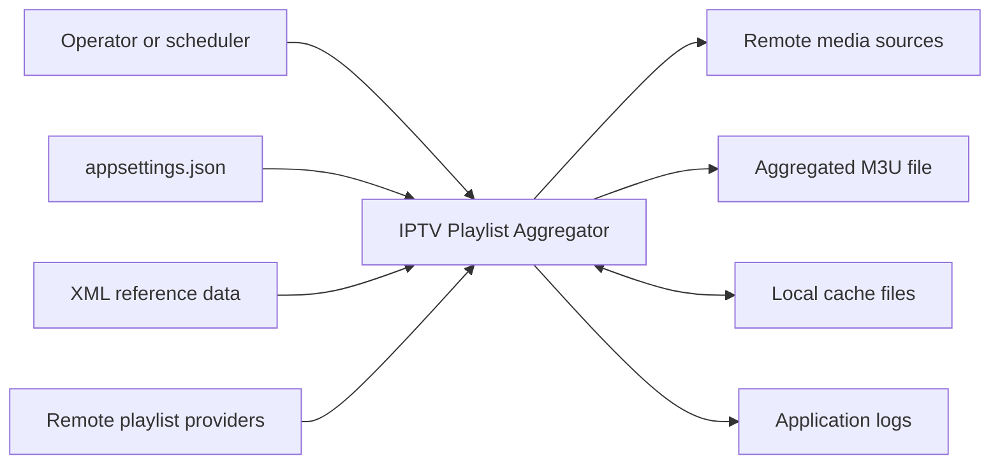
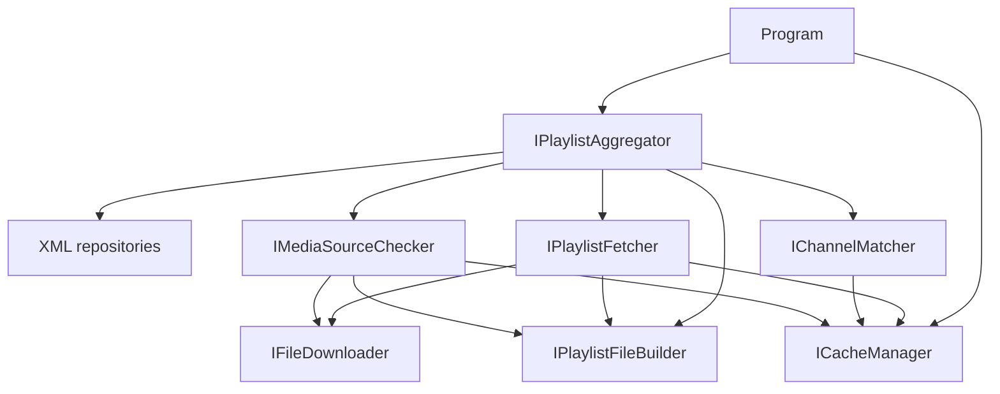
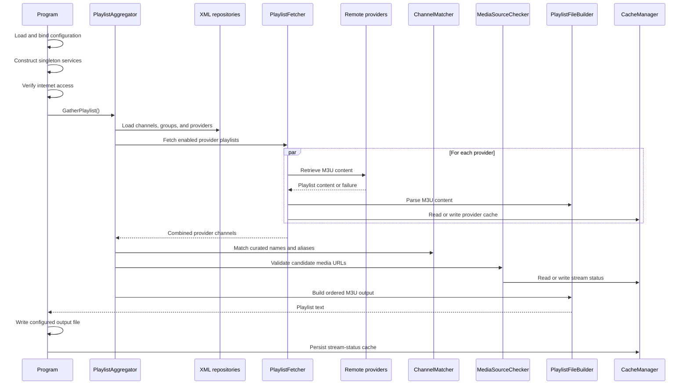
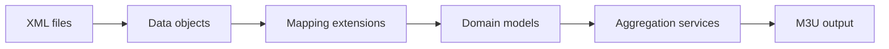

# Architecture

## Purpose

IPTV Playlist Aggregator is a .NET 10 console application that retrieves M3U playlists from configured providers, maps their channels to curated channel definitions, validates media sources, and emits one aggregated M3U playlist.

The application uses a single-process, dependency-injected pipeline. XML files provide reference data, HTTP endpoints provide playlists and media streams, and the local file system stores the generated playlist and persistent stream-status cache.

## System Context



The external boundaries are:
- **Configuration:** `appsettings.json` supplies application, cache, datastore, and logger settings.
- **Reference data:** `Data/channels.xml`, `Data/groups.xml`, and `Data/providers.xml` define the desired channels, output groups, and playlist providers.
- **Provider HTTP endpoints:** remote M3U files are retrieved from provider URL formats.
- **Media HTTP endpoints:** candidate channel URLs are probed to determine whether they are playable.
- **File output:** the aggregated playlist is written to the configured output path.
- **Cache storage:** dated provider playlists and stream-status data are persisted beneath the configured cache directory.
- **Logging:** `NuciLog` records lifecycle and domain operations using the configured sinks and minimum level.

## Architectural Style

The codebase is organised as a pipeline with explicit service contracts:



All application services and repositories use singleton lifetime. This corresponds to the batch-process model and permits the cache manager, downloader, and parser to share in-memory state throughout one execution.

The principal layers are:
- **Composition and process lifecycle:** `Program.cs` loads configuration, constructs the dependency injection container, checks connectivity, invokes aggregation, writes the result, persists the cache, and records process-level failures.
- **Application services:** `Service/` contains orchestration, retrieval, parsing, matching, media validation, caching, and output generation.
- **Domain models:** `Service/Models/` represents playlists, channels, curated definitions, groups, providers, and stream states.
- **Persistence adapters:** `DataAccess/DataObjects/` models XML records; `NuciDAL` repositories read those records from configured files.
- **Mappings:** `Service/Mapping/` converts XML data objects to and from domain models so service logic does not operate directly upon persistence records.

## Runtime Flow



The runtime sequence is:
1. `Program` loads `appsettings.json` and binds `ApplicationSettings`, `CacheSettings`, and `DataStoreSettings`.
2. The dependency injection container registers the settings, logger, services, and three XML repositories.
3. The application records startup and terminates early when no internet connection is detected.
4. `PlaylistAggregator` retrieves the channel definitions, groups, and providers from their repositories and maps them into domain models.
5. `PlaylistFetcher` retrieves enabled provider playlists concurrently. It can use dated cache files and prior dates when a provider URL contains a date substitution marker.
6. `PlaylistFileBuilder` parses provider M3U content into `Playlist` and `Channel` models.
7. `PlaylistAggregator` de-duplicates candidate channels by URL and matches them to enabled curated definitions.
8. `ChannelMatcher` compares normalised names and aliases. `MediaSourceChecker` validates candidate URLs and classifies their stream state.
9. Matched channels are ordered using configured group and channel information. Unmatched channels can be appended when enabled.
10. `PlaylistFileBuilder` serialises the result as M3U text, optionally including TV guide and source-playlist tags.
11. `Program` writes the M3U text to `ApplicationSettings.OutputPlaylistPath`, persists stream statuses, and records shutdown.

## Components

| Component | Responsibility | Principal Dependencies |
|-----------|----------------|------------------------|
| `Program` | Configuration, composition, connectivity gate, output write, top-level exception handling, cache persistence | Configuration, dependency injection, `IPlaylistAggregator`, `ICacheManager`, `ILogger` |
| `PlaylistAggregator` | Coordinates the complete aggregation pipeline and output ordering | XML repositories, `IPlaylistFetcher`, `IChannelMatcher`, `IMediaSourceChecker`, `IPlaylistFileBuilder`, settings, logger |
| `PlaylistFetcher` | Retrieves enabled provider playlists concurrently, applies provider metadata, and manages dated playlist fallback | `IFileDownloader`, `IPlaylistFileBuilder`, `ICacheManager`, settings, logger |
| `FileDownloader` | Retrieves remote text using a reusable HTTP client and an in-memory response cache | `ICacheManager`, logger |
| `PlaylistFileBuilder` | Parses M3U text into domain models and serialises domain models into M3U output | `ICacheManager`, settings |
| `ChannelMatcher` | Normalises channel names and matches definitions by canonical name or alias | `ICacheManager` |
| `MediaSourceChecker` | Rejects unsupported or blacklisted URLs, probes HTTP media sources, and classifies stream status | `IFileDownloader`, `IPlaylistFileBuilder`, `ICacheManager`, logger |
| `CacheManager` | Owns concurrent in-memory caches, dated provider playlist files, and persistent stream-status records | Cache settings, logger |
| `XmlRepository<T>` | Reads strongly typed records from the three configured XML files | `NuciDAL`, datastore settings |

Interfaces separate orchestration from implementations and permit the unit tests to isolate services with mocks. Repository abstractions similarly isolate service logic from the XML storage implementation.

## Data Model

Reference data passes through a deliberate persistence-to-domain mapping boundary:



The principal records are:
- `ChannelDefinitionDataObject` and `ChannelDefinition` describe a curated channel, its canonical name, aliases, country, group, and logo.
- `GroupDataObject` and `Group` describe an output group, its priority, and whether it is enabled.
- `PlaylistProviderDataObject` and `PlaylistProvider` describe a provider URL format, priority, country, cache preference, optional channel-name override, and enabled state.
- `Playlist` contains provider-derived `Channel` records.
- `ChannelName` groups a canonical value, country, and aliases for matching.
- `MediaStreamStatus` records a URL, its `StreamState`, and the last validation time.
- `StreamState` distinguishes `Alive`, `Dead`, `Unauthorised`, `NotFound`, `Unsupported`, and `Blacklisted` sources.

XML repositories are used as read-only inputs during normal execution. Although mappings exist in both directions, this application does not persist domain modifications to the XML reference files.

## Matching and Selection

Channel selection combines curated definitions with provider availability:
- Only enabled groups, channel definitions, and providers participate.
- Provider channels are de-duplicated by media URL before matching.
- Names are normalised before comparison through diacritic removal, embedded regular-expression replacements, upper-case conversion, and retention of ASCII letters and digits.
- A definition can match its canonical name or any configured alias.
- Candidate media sources must pass `MediaSourceChecker` before they are selected.
- Curated channels are ordered by group priority and then channel-definition name.
- Provider playlists are keyed by numeric priority and emitted in ascending priority order. Providers must therefore use distinct priorities; a later provider with the same priority replaces the previous playlist at that priority.
- When multiple provider channels match one definition, the first playable candidate in merged provider order is selected.
- When `AreUnmatchedChannelsIncluded` is enabled, provider channels without curated definitions are included after the curated set.

## Caching

`CacheManager` maintains several caches with different persistence policies:

| Cache | Storage | Lifetime |
|-------|---------|----------|
| Normalised channel names | Concurrent in-memory dictionary | Current process |
| Downloaded text | Concurrent in-memory dictionary | Current process |
| Parsed playlists | Concurrent in-memory dictionary | Current process |
| Stream statuses | Concurrent in-memory dictionary plus CSV persistence | Configurable by stream state across processes |
| Provider playlists | Dated M3U files | Controlled per provider |

Stream-status expiry is configured independently for alive, dead, unauthorised, and not-found results. Unsupported and blacklisted results have no configured expiration. Expiration is evaluated when the CSV cache is loaded at process startup. During an execution, the first status stored for a URL remains in the concurrent dictionary; it is not revalidated after its configured interval elapses.

Provider cache files use the provider identifier and date. For date-based providers, the fetcher can inspect previous dates up to `ApplicationSettings.DaysToCheck` when the current URL does not produce a usable playlist.

## Concurrency and Resource Use

The batch pipeline introduces concurrency at two levels:
- Provider downloads execute as multiple tasks and are joined before aggregation continues.
- Channel matching and unmatched-channel processing use parallel loops.

Concurrent dictionaries and bags protect shared state during these phases. Media validation is asynchronous at its boundary, although the aggregator currently waits synchronously for validation results inside its parallel matching loop. Parallelism is not explicitly bounded, so the runtime and remote endpoints determine the practical concurrency limit.

`FileDownloader` reuses one HTTP client for the process and applies a brief request timeout. The application is designed for finite command-line executions rather than continuous hosting.

## Configuration

Configuration is divided by responsibility:
- `ApplicationSettings` controls the output path, date fallback window, unmatched-channel inclusion, and optional M3U metadata tags.
- `CacheSettings` controls the cache directory and state-specific stream-status expiration.
- `DataStoreSettings` supplies the XML repository paths.
- `nuciLoggerSettings` configures logging destinations and severity.

The configuration file and XML data files are copied to the application output directory during the build. Paths are interpreted relative to the process working directory unless configured as absolute paths.

## Failure Handling

Failure handling is intentionally local where degradation is possible and process-level where it is not:
- Download failures return no content, permitting provider fallback or omission rather than terminating the complete aggregation.
- Invalid playlist content is treated as an unusable playlist.
- Media request failures are translated into stream states and cached according to state-specific policies.
- `AggregateException` is recursively expanded at the process boundary so each underlying failure is logged.
- Other unhandled exceptions are recorded as fatal errors.
- Cache persistence and shutdown logging occur after aggregation exceptions, but the early no-internet return bypasses those final operations.

The application does not currently expose an explicit process exit code for partial provider failures or aggregation exceptions; operational diagnosis relies upon logs and the presence and contents of the output file.

## Testing

`IptvPlaylistAggregator.UnitTests` uses NUnit and Moq. The tests concentrate upon deterministic service behaviour:
- channel-name normalisation and alias matching;
- media-source filtering and classification;
- M3U parsing and serialisation;
- playlist model behaviour.

Service interfaces permit network, cache, repository, and logger dependencies to be replaced by mocks. The suite does not currently provide an end-to-end test that exercises genuine XML files, remote HTTP endpoints, and file output together.

Execute all tests with:

```bash
dotnet test IptvPlaylistAggregator.slnx
```

## Design Constraints

The current design favours a compact batch application over a distributed or continuously hosted system:
- A single orchestrator owns the workflow; there is no queue, database, web API, or background host.
- Singleton services retain state for one process execution.
- XML reference files are appropriate for manually curated, version-controlled data but do not provide transactional concurrent editing.
- In-memory de-duplication and caches presume that one execution fits within available memory.
- Playlist parsing expects conventional M3U `#EXTINF` and URL sequencing.
- Concurrent provider retrieval and media probing reduce execution time but can generate a substantial number of outbound requests.
- Provider priority doubles as the playlist merge key, so duplicate priorities discard all but one of the corresponding provider playlists.
- Stream-status persistence uses a simple local CSV representation and consequently is intended for one application instance per cache directory. URLs containing commas are truncated when written because fields are not CSV-escaped.

## Extension Points

The existing boundaries support focused extensions:
- Implement another `IFileRepository<T>` adapter to source definitions from a different datastore.
- Implement another `IFileDownloader` to introduce specialised authentication, retry, or transport policies.
- Extend `IChannelMatcher` for additional normalisation or matching policies.
- Extend `IMediaSourceChecker` for protocols beyond the currently supported HTTP-oriented checks.
- Extend `IPlaylistFileBuilder` for additional playlist dialects or output metadata.

New implementations can be selected in `ServiceCollectionExtensions` without modifying the orchestration contract.

## Source Map

| Area | Path |
|------|------|
| Composition root | `IptvPlaylistAggregator/Program.cs` |
| Dependency registrations | `IptvPlaylistAggregator/Service/ServiceCollectionExtensions.cs` |
| Application services | `IptvPlaylistAggregator/Service/` |
| Domain models | `IptvPlaylistAggregator/Service/Models/` |
| Persistence mappings | `IptvPlaylistAggregator/Service/Mapping/` |
| XML data objects | `IptvPlaylistAggregator/DataAccess/DataObjects/` |
| Runtime configuration | `IptvPlaylistAggregator/appsettings.json` |
| Reference data | `IptvPlaylistAggregator/Data/` |
| Unit tests | `IptvPlaylistAggregator.UnitTests/Service/` |